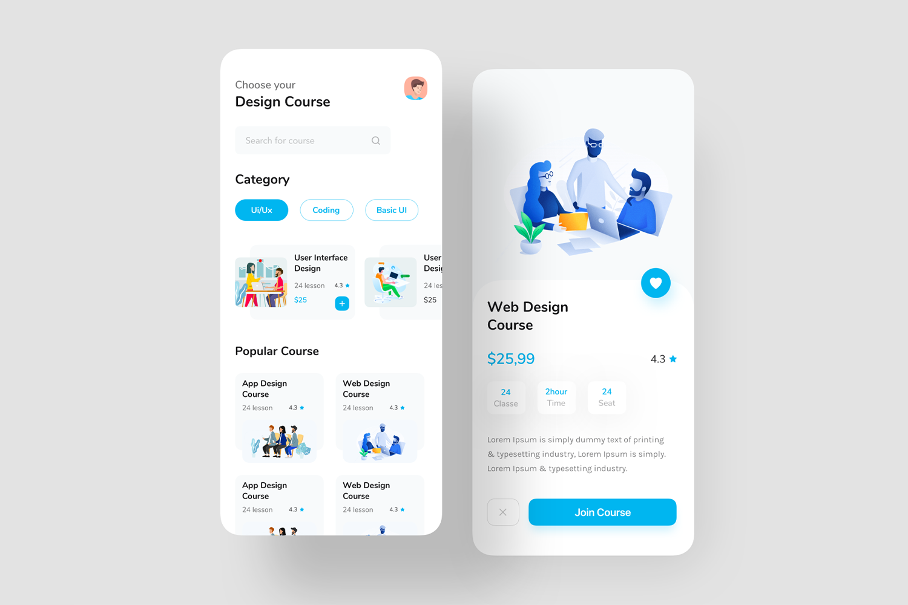
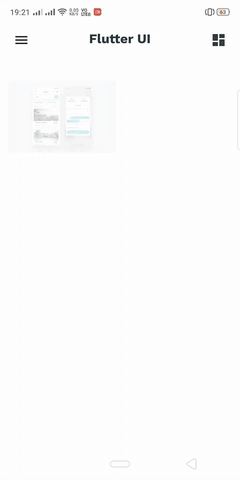
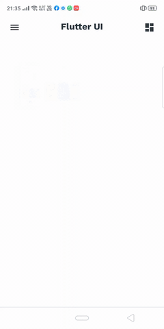
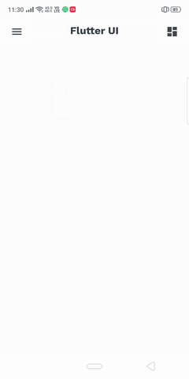

Original Developer -> Mitesh Chodvadiya
 
Do check His Work -> https://github.com/mitesh77

# Best-Flutter-UI-Templates
completely free for everyone. Its build-in Flutter Dart.

### Some Screenshots

 
